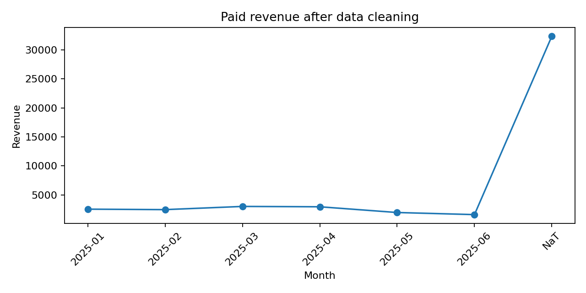

## Python Data Cleaning & Quality Report

**Role:** Data Analyst / Python Analyst  
**Dataset:** Synthetic / anonymized demo data created for portfolio use  
**Stack:** Python, pandas, matplotlib, CSV/Excel processing

---

## Business problem

Raw customer order data contained duplicate rows, inconsistent date formats, text-based numeric values, mixed city names, missing emails, and inconsistent order statuses.

The goal of this project was to build a reproducible data-cleaning pipeline that converts messy operational data into a clean dataset, a quality summary report, and a simple revenue visualization.

---

## What was built

Built a Python/pandas cleaning pipeline that:

- standardizes emails, phone numbers, city names, dates, order statuses and revenue fields;
- removes duplicate rows;
- validates and normalizes core fields;
- exports a clean customer-order dataset;
- generates a reusable data-quality summary;
- creates a revenue visualization after cleaning.

---

## Key results

| Metric | Result |
|---|---:|
| Raw rows | 945 |
| Clean rows | 900 |
| Duplicates removed | 45 |
| Missing emails after cleaning | 28 |
| Paid orders | 395 |
| Total paid revenue | $46,912.19 |
| Clean export generated | Yes |
| Quality summary generated | Yes |
| Revenue visualization generated | Yes |

---

## Key outputs

- `results/clean_customer_orders.csv` — cleaned dataset
- `results/cleaning_summary.csv` — data quality metrics
- `results/revenue_after_cleaning.png` — revenue visualization after cleaning
- `results/run_log.txt` — pipeline execution summary

---

## Revenue after cleaning



---

## Project structure

```text
python-data-cleaning-report/
├── README.md
├── requirements.txt
├── data/
│   └── raw_customer_orders.csv
├── src/
│   └── main.py
└── results/
    ├── clean_customer_orders.csv
    ├── cleaning_summary.csv
    ├── revenue_after_cleaning.png
    └── run_log.txt
  ## Freelance use cases

I can adapt this project for:

- cleaning client CSV/Excel files;
- building automated data-quality reports;
- creating Google Sheets / Excel dashboards;
- building trading journal dashboards;
- analyzing PnL, win rate, drawdown and strategy performance.


